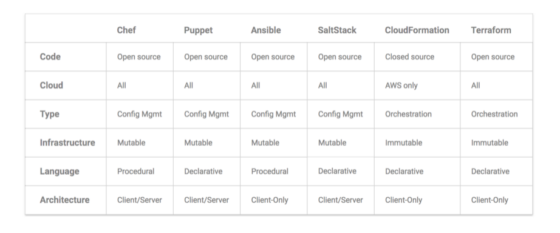

# Terraform

Terraform is a tool which brings an agnostic way of managing cloud infrastructure (build, change & version).
Configuration files serve as source of truth for your infrastructure.

Terraform shines by :

- generating an execution plan describing the changes to the infrastructure.
- Tracks the state of infrastructure.

Terraform use cases:

- Multi-Cloud deployment
- Creating disposable environments
- Software demo environments

Terraform helps managing the everygrowing infrastruture by effectively applying the Infrastrutcure as
code principles. Since it is an agnostic way of managing the infrastructure it makes sense to invest
in it (prevents vendor lockdown).

Terraform does not:

- replace confiruration management tools e.g. chef, puppet, ansible, saltstack etc.
- replace Cloud specific APIs e.g. boto, AzureRM APIs etc.

## Why Terraform then

CM tools like Ansible, Chef are a good fit with mutable infrastructure and good fit for configuration management only.
Terraform is an orchestration tool which is a good fit for provisioning infrastucture atop cloud vendors.

With tools like Docker, Packer coming into picture and immutable infrastructure gaining traction, most of the config mgmt
needs are already handled by the base image. So Terraform is a perfect fit for this practice.



Summary from article [Source](https://blog.gruntwork.io/why-we-use-terraform-and-not-chef-puppet-ansible-saltstack-or-cloudformation-7989dad2865c)

Example - OpenAI (Elon Musk's AI initiative) runs atop of Azure using Terraform.

## Terraform components

- Terraform executable - single binary
- Terraform file - one or more files that have info about my desired deployment.
- Terraform state file - created when terraform is run
- Terraform preferences

**Some Basics first**:

- Terraform uses configuration files to describe infrastucture (only the end state).
- These files end up with .tf extension and are called Terraform configurations.
- Terraform loads all the .tf files placed in a directory.
- Terraform configuration use HashiCorp Configuration language (HCL)

Sample configuration for deploying resource group in Azure.

```hcl
## resource group
resource "azurerm_resource_group" "terraform_rg" {
    name = "bitpro"
    location = "SouthIndia"
}
```

## Getting started

There are two routes one can take in order to setup for using Terraform :

- Configure your development environment
- Use Azure cloud shell

### Configure your development environment

#### Install terraform

As simple as downloading the binary and placing it in the path variable.

```powershell
Install-Package -Name Terraform
```

or if you are using chocolatey installer choco.

```bash
choco install Terraform
```

Validate that the terraform is placed in your Path variable (PowerShell/Cmd requires a restart).

```bash
terraform --version
```

#### Get the Azure pre-requisites ready

```bash
# set the default subscription
az account set --subscription='<subscription id here>'
# create the service principal which will have permissions to manager resources in the subscription
az ad sp create-for-rbac --role="Contributor" --scopes="/subscriptions/<subscription id here>"
```

The above command will output like below, which will be used in our terraform file.

```json
  "appId": "0790cb90-09dc-4db4-987d-bc8642021067",
  "displayName": "azure-cli-2017-11-16-13-25-25",
  "name": "http://azure-cli-2017-11-16-13-25-25",
  "password": "",
  "tenant": ""
```

### Use Azure cloud shell

It has by default the AzureRM provisioner installed.

```bash
terraform providers
```

## Build Infrastructure

Once you have configured your local development workstation then you are ready to provision cloud infrastructure.
Copy the auth.tf and resourcegroup.tf files in a local folder say terraform-demo.

Once you have copied the above .tf configurations, run the below command for terraform to know that
this directory contains the required configurations for your infrastructure.

```powershell
terraform init
```

Ideally, if you have the files auth.tf and resourcegroup.tf placed and running *terraform init* after that
downloads the azurerm provisioner inside a .terraform directory (under current one).

The true power of Terraform is in seeing the plan. Let's run the below to see what Terraform will do, without
actually changing anything.

```powershell
terraform plan
```

Review the changes the terraform configurations will make and then run below to apply those changes.

```powershell
terraform apply
```

**Note** - Make a note of the terraform.tfstate file which gets created and which tracks your infrastructure.

One can run *terraform show* at any point in time to see the current status of the infrastructure.

In order to just destroy the infrastructure just spinned up do the below.

```powershell
terraform destroy
```

## Resource links

[Terraform Documentations](https://www.terraform.io/docs/index.html)

[Comprehensive guide to Terraform](https://blog.gruntwork.io/a-comprehensive-guide-to-terraform-b3d32832baca)
[Webinar on getting started Terraform with AWS](https://www.youtube.com/watch?v=TFLQcgZr0no)
[HashiCorp Youtube Channel](https://www.youtube.com/channel/UC-AdvAxaagE9W2f0webyNUQ)
